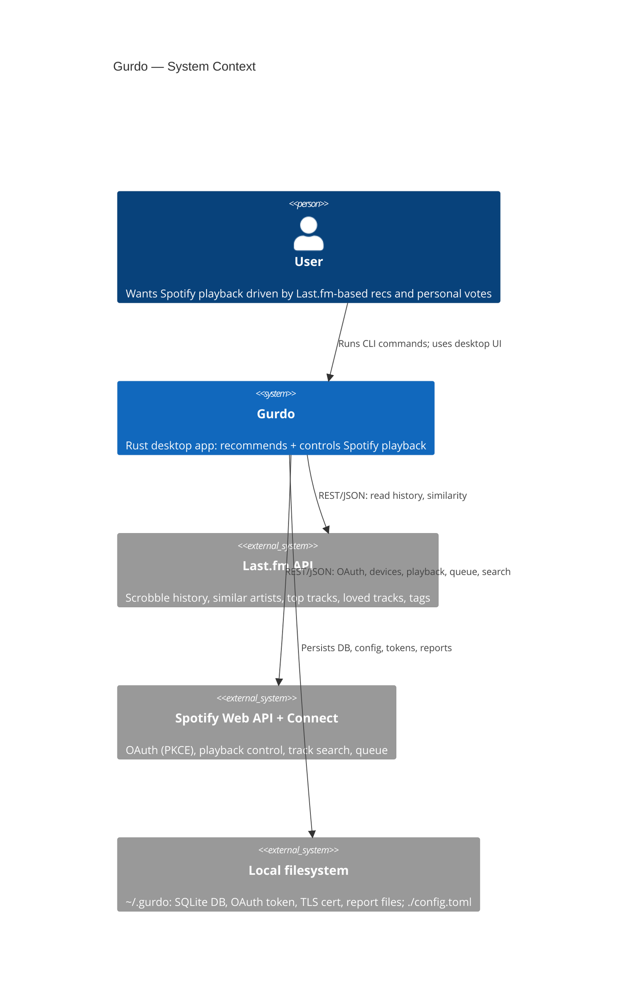
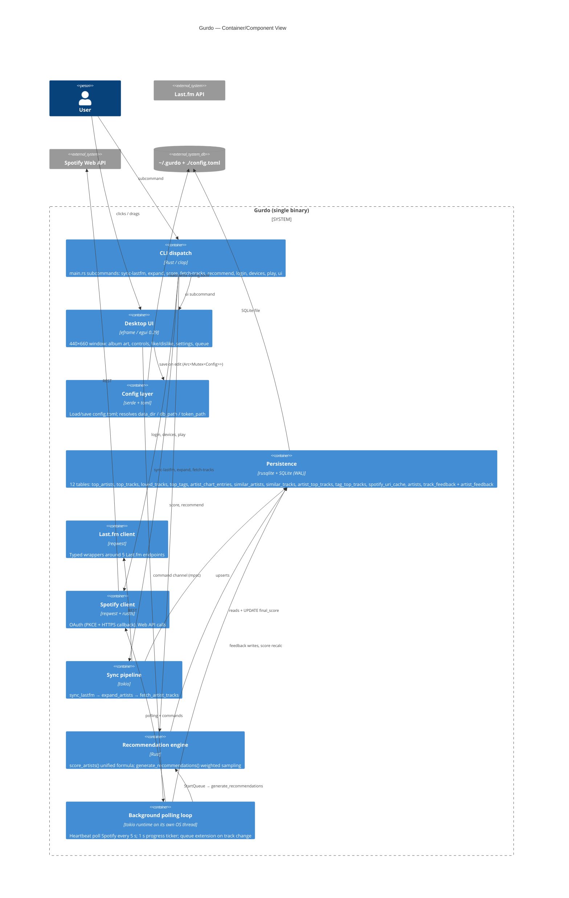

# Analysis — Gurdo

*Phase: Analysis · Mode: improve · Date: 2026-05-11*

Snapshot of the existing codebase as it stands today. Used as the baseline for Vision, Architecture, and Backlog phases.

---

## 1. What it is

**Gurdo** is a single-binary Rust desktop app (~4 900 LOC, edition 2024) that builds a music recommendation engine on top of Last.fm scrobble history + user feedback, and plays the resulting queue through an existing Spotify Connect device.

Two execution surfaces:
- **CLI subcommands** (`clap`) for batched data pipeline steps — `sync-lastfm`, `expand`, `score`, `fetch-tracks`, `recommend`, `login`, `devices`, `play`.
- **Desktop UI** (`eframe`/`egui` 0.29, fixed 440×660 non-resizable window) — `gurdo ui` — for playback control, like/dislike feedback, queue generation, and a settings panel.

State lives in a single SQLite DB at `~/.gurdo/gurdo.db` (WAL mode) plus a TOML config at `./config.toml`.

---

## 2. Tech stack

| Layer | Library | Notes |
|---|---|---|
| Lang/runtime | Rust 2024 edition, `tokio` 1 (multi-thread) | |
| HTTP | `reqwest` 0.12 (JSON) | Used for both Last.fm and Spotify |
| Storage | `rusqlite` 0.31 (bundled SQLite, `functions`) | Schema in `src/db/schema.rs` |
| Config | `toml` 0.8 + `serde` 1 | Read-write via [src/config.rs](src/config.rs) |
| CLI | `clap` 4 derive | [src/main.rs](src/main.rs) |
| Errors | `anyhow` | |
| Logging | `tracing` + `tracing-subscriber` (env-filter) | `gurdo=info`, `gurdo::ui=debug` |
| OAuth callback | `rcgen` + `rustls` + `tokio-rustls` (self-signed cert), `sha2` + `rand` + `base64` (PKCE), `open` (browser) | |
| Desktop UI | `eframe` 0.29 (egui), `image` 0.25 (jpeg/png) | |
| Misc | `chrono` (serde feature), `urlencoding` | |

No tests, no CI, no benchmarks, no Dockerfile, no editor/IDE configs committed. `.gitignore` only excludes `/target`.

---

## 3. Repository layout

```
gurdo/
├── Cargo.toml            ← single binary crate
├── config.toml           ← runtime config (committed; contains API keys)
├── config.toml.example   ← reference config
├── IDEAS.md              ← 10 documented improvement ideas (algorithm-focused)
├── plan                  ← author's design notes ("How app should work")
├── test.json             ← appears to be cached test/fixture data
└── src/
    ├── main.rs           ← CLI dispatch + tracing init
    ├── config.rs         ← Config structs (Lastfm/Spotify/App/Ui/Sync/Engine/ArtistScoring/Recommendations)
    ├── db/               ← SQLite open + schema (init_db) + ~30 query helpers
    │   ├── schema.rs     ← table DDL, migrations
    │   └── queries.rs    ← upserts, reads, feedback handling, score recalc
    ├── lastfm/           ← API client + serde models
    │   ├── client.rs     ← user.getLovedTracks, user.getTopTags, artist.getSimilar, artist.getTopTracks, user.getWeeklyArtistChart
    │   └── models.rs
    ├── spotify/          ← OAuth (PKCE + HTTPS callback) + client + models
    │   ├── auth.rs       ← run_oauth_flow, load_or_refresh_token, self-signed cert
    │   ├── client.rs     ← devices, currently_playing, play, pause, next, previous, seek, queue, search
    │   └── models.rs
    ├── sync/             ← Pipeline stages
    │   ├── artists.rs    ← year-by-year chart sync (weekly artist chart aggregation)
    │   ├── expand.rs     ← similar-artist expansion + fetch_artist_tracks
    │   └── mod.rs        ← sync_lastfm orchestrator + score_external_artists
    ├── engine/
    │   ├── artist_scores.rs ← score_artists() + report writer
    │   └── recommend.rs  ← weighted-sample track generation (artist^a × 1/rank^b)
    └── ui/
        ├── mod.rs
        └── app.rs        ← 876 LOC monolith: GurdoApp, polling_loop, command handler, settings draft, color extractor
```

---

## 4. C4 Context diagram



---

## 5. C4 Container diagram



---

## 6. Data pipeline (current end-to-end flow)

1. **`sync-lastfm`** → fetch loved tracks (registered as likes) + top tags + year-by-year weekly artist charts → write to `loved_tracks`, `top_tags`, `artist_chart_entries`. Then `score_external_artists` aggregates per-artist totals + years_active, computes `playcount_score` (0–100, exponent-scaled) and `year_bonus`, and upserts as `source='external'` rows in `artists`.
2. **`expand`** → for each external artist, fetch `artist.getSimilar` (cached in `similar_artists`). Aggregate cross-artist similarity (best_source, appearances). Persist `similarity_score = best_source_base × similarity_multiplier` and appearance counts into `artists` (creating `source='similar'` rows for new artists).
3. **`fetch-tracks`** → for each artist (external + similar), pull top 50 tracks into `artist_top_tracks`. Cache-aware (skips if synced).
4. **`score`** → `recalculate_all_scores` applies the unified SQL formula and produces `recommendations/artist_scores.txt` report:
   ```
   final = (playcount_score × year_bonus
         + similarity_score × (1 + multi_source_bonus × (appearances−1))
         + likes × like_bonus_flat)
         × max(0, 1 − dislikes × dislike_pct)
   ```
5. **`recommend`** / **`play`** / **UI `StartQueue`** → `generate_recommendations` does weighted random sampling: artist∝`final_score^artist_exp`, track∝`1/rank^track_exp`, skipping disliked. Returns up to `count` `(artist, track)` pairs. For playback, each pair is resolved via Spotify search to a URI and queued.
6. **UI runtime** → 5 s Spotify heartbeat + 1 s local progress ticker; on track-end or track change, checks Spotify queue against `our_uris` and extends in chunks of 10 when ≤1 of ours remain. Like/dislike calls `record_feedback` + per-artist `recalculate_artist_score`.

---

## 7. Configuration surface (`config.toml`)

```toml
[lastfm]            api_key, username
[spotify]           client_id, redirect_uri, callback_port
[app]               data_dir
[ui]                background_color = [R,G,B]
[sync]              seed_artists_limit, seed_tracks_limit, loved_tracks_limit
[engine]            similarity_multiplier, multi_source_bonus_pct,
                    like_bonus_flat, like_modifier_pct, dislike_modifier_pct,
                    similar_artists_limit, similar_tracks_limit,
                    artist_top_tracks_limit, tag_top_tracks_limit,
                    recommendation_pool_size, max_tracks_per_seed
[artist_scoring]    score_exponent, year_bonus_pct, min_playcount_threshold
[recommendations]   count, artist_score_exponent, track_rank_exponent
```

≈ 22 tunables. The settings panel in `ui/app.rs` currently exposes **9 of them**:
`rec_count`, `rec_artist_exp`, `rec_track_exp`, `score_exp`, `year_bonus_pct`,
`min_playcount`, `similar_artists_limit`, `similarity_multiplier`, `artist_top_tracks_limit`.

The rest (e.g. `like_bonus_flat`, `dislike_modifier_pct`, `multi_source_bonus_pct`, all `*_tracks_limit`, all of `[ui]`) are config-file only.

A handful of constants are still hardcoded outside config:
- `engine/mod.rs` legacy weights (per `IDEAS.md` #7 — partially migrated already; some scoring multipliers may still be inline).
- `ui/app.rs`: button sizes (60×60, 110×40), font sizes (22, 14.4, 28, 10), progress-bar width 380, window size 440×660, queue chunk size 10, art size 400×400.
- `sync/expand.rs`: `TRACKS_PER_ARTIST = 50` (shadows `engine.artist_top_tracks_limit`).

---

## 8. UI today

Single-screen layout in [src/ui/app.rs:129-233](src/ui/app.rs#L129-L233):

```
┌──────────────────────────────┐
│           [album art 400×400] │
│       Track name (22 pt, bold)│
│        Artist name (14.4 pt)  │
│       [══════════] 1:23 / 3:45│
│   ⏮  ⏪  ▶  ⏩  ⏭             │  ← 5× 60×60 buttons
│   ♥ Like   👎 Dislike   ☰  ⚙ │  ← feedback + queue + settings
└──────────────────────────────┘
```

Settings is a modal `egui::Window` with three grouped sections (Recommendations / Artist Scoring / Expand / Fetch Tracks) plus a "Last.fm" row that spawns the `gurdo` CLI in a subprocess via `std::process::Command` for `sync-lastfm`, `score`, `expand`, `fetch-tracks`.

The window is **fixed-size, non-resizable**, single page — no library/history view, no current-queue list, no recommendation preview, no per-artist drill-down. Sub-process CLI spawn has no progress visibility and silently swallows failures (`let _ = ...spawn()`).

---

## 9. Background-color extraction (the broken bit)

[src/ui/app.rs:118-120](src/ui/app.rs#L118-L120) — the call is commented out:

```rust
// Dynamic background color from album art — disabled for now.
// self.bg_color = extract_dominant_color(bytes);
```

The function [extract_dominant_color](src/ui/app.rs#L368-L414) exists but the **bucketing + saturation-filter path is also commented out** (lines 379-396). What's actually running is the fallback at lines 399-406: **plain mean of every pixel in a 32×32 thumbnail**, then `× 0.33` darken. That's why output trends gray-brown for most album art — averaging all colors in a typical photographic cover collapses to a muddy neutral (the "every color = brown" effect).

The current `[ui].background_color = [27, 27, 27]` config value bypasses extraction entirely and applies a static near-black fill to `visuals.panel_fill`.

Why the in-bucket approach as written would also struggle:
- HSV/saturation filter was *commented out before activation* — the bucketing path bins every pixel regardless of vibrancy.
- 32 bins per channel (8 buckets) is coarse, but it still picks the single most populated bucket — for desaturated covers (B&W photography, posters with dark backgrounds) that's still a gray/brown bucket.
- No perceptual color space — euclidean RGB clustering systematically prefers muddy colors because dark/desat regions occupy more pixels than the vibrant accents.

Better candidate approaches to consider in Vision/Architecture:
- **Median cut** or **k-means in CIELAB/OKLab** — perceptual color space + cluster-then-rank-by-vibrancy.
- **Vibrant.js-style palette extraction** — Palette extraction by *saturation + value targets*: vibrant / muted / dark-vibrant etc. (Material You / Android Palette library is the reference.)
- **Filtering before clustering** — drop pixels with chroma < threshold, then cluster remainders.
- **OKLab + weighted score**: `score = chroma × log(count)` rewards both populated *and* vibrant colors.
- Existing Rust crates: `color-thief`, `kmeans-colors`, `palette` (for color-space math).

---

## 10. External integrations

| Service | Auth | Endpoints used |
|---|---|---|
| Last.fm API | Static API key in `config.toml` (committed!) | `user.getLovedTracks`, `user.getTopTags`, `user.getWeeklyArtistChart`, `artist.getSimilar`, `artist.getTopTracks` |
| Spotify Web API | OAuth 2.0 PKCE; redirect via local HTTPS server on `127.0.0.1:8888` with rcgen self-signed cert; refresh token cached in `~/.gurdo/spotify_token.json` | `GET /me/player`, `GET /me/player/devices`, `GET /me/player/queue`, `PUT /me/player/play`, `PUT /me/player/pause`, `POST /me/player/next` / `previous`, `PUT /me/player/seek`, `POST /me/player/queue`, `GET /search` |
| Filesystem | none | `~/.gurdo/{gurdo.db, spotify_token.json, localhost.{crt,key,pem}, recommendations/}` |

---

## 11. Test coverage

**None.** No `tests/` directory, no `#[cfg(test)]` modules, no `#[test]` functions, no integration tests, no CI workflow. Manual smoke-testing only.

Risk areas with no automated coverage:
- Scoring math (the unified SQL `recalculate_all_scores`) — silently regresses under config changes.
- Weighted sampling (`engine/recommend.rs::weighted_sample`) — easy to verify with deterministic RNG.
- Spotify queue extension logic in `ui/app.rs::extend_queue_if_needed`.
- OAuth refresh path.
- Last.fm/Spotify model deserialization — schema drift breaks silently.

---

## 12. Known issues & tech debt

**From IDEAS.md** (author's own backlog, 10 items — abbreviated):
1. Fetch full artist history (3 700+ artists vs ~100–200 currently captured).
2. Loved-tracks → artist-seed promotion.
3. Tag quality (region/language tags pollute genre matching; no blocklist).
4. Depth-2 similar-artist expansion.
5. Tune similar-artist limits to reduce popularity bias.
6. Drop track-level similarity (`similar_tracks` table is dead-weight; not referenced by recommend).
7. **Extract all scoring weights to config** — partially done; some constants still inline.
8. Two-stage recommendation (recommend artists → then tracks contextually).
9. Configurable playlist mix (well-known / similar / potentially-similar percentages).
10. Playback feedback loop refinement (skip ≠ downvote, etc.) — partly in place via like/dislike, no skip handling.

**From `plan` doc** (open algorithmic questions, *not* yet resolved):
- Transition of an artist from unknown → known is not handled gracefully — re-sync required and only if ≥50 plays.
- Similar-artist scoring can outweigh known-artist plays in ways that feel wrong.

**Scope decision from user (2026-05-11):**
- **The `clap` CLI is legacy and to be removed.** It predates the desktop UI. All operations (sync, expand, score, fetch-tracks, recommend, login, devices, play) must run in-process from the UI, not via spawning the `gurdo` binary as a subprocess. `main.rs` should collapse to: load config → open DB → run UI. `clap` becomes a removable dependency.

**Surfaced from code reading:**
- **`config.toml` contains live API keys and is tracked by git** (`.gitignore` only excludes `/target`). Lastfm `api_key` + Spotify `client_id` are committed. The username `grucha666` is committed.
- **No tests, no CI.**
- **`ui/app.rs` is 876 LOC** — single file mixing widget rendering, command channel, async polling loop, command handler, image decode, color extraction, font loading, settings draft. Hard to test.
- **Background-color extraction is dead code** — function exists, internals are commented out, call site is also commented out.
- **CLI spawn from UI swallows errors** ([src/ui/app.rs:421-429](src/ui/app.rs#L421-L429)) — `let _ = ...spawn()`; no progress, no status feedback to the user; relies on `gurdo` being on `PATH`.
- **Window is fixed-size 440×660 non-resizable** — no responsiveness, no way to surface lists (queue / library / artist scores).
- **`similar_tracks` table is populated but unread** — `engine/recommend.rs` only reads `artist_top_tracks`. Dead schema.
- **`TRACKS_PER_ARTIST = 50` in [src/sync/expand.rs:12](src/sync/expand.rs#L12) shadows `engine.artist_top_tracks_limit`** from config.
- **Hardcoded UI dimensions, button sizes, padding values** throughout `ui/app.rs` — no theming layer.
- **No way for the UI to drive a sync** without a separate `gurdo` binary on PATH — the UI can only spawn external CLI subprocesses, not invoke the in-process sync functions directly. Implies UI runs without progress UX during long syncs. (Per user direction this whole CLI surface is going away; the fix is "make UI call sync functions directly with progress UI", not "improve the spawn pipeline".)
- **Cargo.lock not in `.gitignore`** ✓ — committed (correct for a binary crate).
- **Settings panel layout is dense, single-column, no validation feedback, no "reset to default", no descriptions of what knobs mean.** Save-on-every-edit means accidental scroll changes can mutate config silently.
- **No "current queue" view in UI** — `our_uris` exists internally but is never rendered.

---

## 13. CI/CD

None.

---

## 14. Summary — entry point for Vision

The codebase is a working but rough single-developer app. It has a clean separation between data pipeline, persistence, and UI shell, but the UI is one cramped fixed window that exposes only a fraction of the configuration surface and hides most algorithmic levers, and the background-color extraction (a UX nice-to-have) is left as a dead, broken stub. There are no tests, the config file leaks credentials, and the file `ui/app.rs` has outgrown a single-module shape.

The author's IDEAS.md and `plan` make it clear that the *algorithm* has substantial planned evolution; this improvement cycle is scoped narrower:
- **UI usability** — surface lists/queue/progress; replace the cramped fixed window with a richer layout.
- **Full configuration exposure inside the UI** — every tunable that today lives only in `config.toml` should be reachable from a settings surface (with descriptions, validation, reset-to-default).
- **A working dynamic background color from cover art** — replace the muddy average with a perceptually-meaningful palette extraction.
- **Remove the legacy `clap` CLI** — UI becomes the sole user surface, with in-process sync/expand/score/fetch/recommend driven from the UI with visible progress.

These four threads are the delta that Vision will describe.
