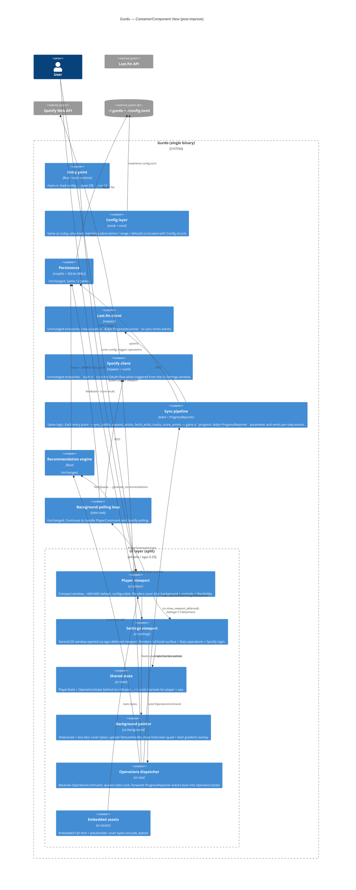

# Architecture — Gurdo (improve cycle, delta mode)

*Phase: Architecture · Mode: improve · Date: 2026-05-11*

Describes the **changes** to the existing architecture required to deliver Vision §6 success criteria. The Analysis C4 diagrams are the baseline; this document records only what gets added, removed, or restructured.

---

## 1. Tech stack — confirmed unchanged, with two adds and two removes

**Locked in (no change):** Rust 2024 edition, `tokio`, `reqwest`, `rusqlite` (bundled SQLite), `serde` + `toml`, `chrono`, `anyhow`, `tracing` + `tracing-subscriber`, `eframe`/`egui` 0.29, `image` 0.25, `rustls` + `tokio-rustls` + `rcgen` (OAuth callback), `sha2` + `rand` + `base64` (PKCE), `urlencoding`, `open`.

**Remove:**
- **`clap`** — the CLI subcommand surface is being deleted. `main.rs` will collapse to: load config → open DB → run UI. No `Cli`/`Command` enums, no `clap::Parser` derive.
- **The OS-font-path probing block in `ui/app.rs`** — replaced by an embedded `.ttf` (see §4).

**Add (no new deps if avoidable):**
- **Three embedded CJK-capable fonts** — `NotoSansSC-Regular.otf` (Simplified Chinese, ~5 MB), `NotoSansJP-Regular.otf` (Japanese — Hiragana, Katakana, kanji, ~5 MB), `NotoSansKR-Regular.otf` (Korean Hangul, ~5 MB). Total ~15 MB binary growth. Shipped in `assets/fonts/` and pulled in with `include_bytes!`. egui 0.29 accepts `.otf` via `FontData::from_static` and supports an ordered fallback chain.
- **A bundled placeholder cover image** — small PNG (~10–50 KB) shipped in `assets/images/placeholder_cover.png`, also `include_bytes!`.

**Considered and rejected:**
- A separate blur crate (e.g. `image-blur`, `fast_blur`). Not needed — `image::imageops::fast_blur` already in our dep tree gives a box-blur approximation of gaussian, fast enough for 400×400.
- Replacing the SQLite layer or moving to `sqlx`. Out of scope.
- Replacing `eframe` with `tauri`/`iced`. Out of scope.

---

## 2. C4 Context — no change

The system context from [Analysis §4](ana-analysis.md#4-c4-context-diagram) is unchanged: User → Gurdo → {Last.fm API, Spotify Web API, local filesystem}. No new external integration, no new actor.

---

## 3. C4 Container — delta diagram



### Components added

| Component | Path | Responsibility |
|---|---|---|
| `ui::player` | `src/ui/player.rs` | The player viewport — what `app.rs` renders today (album art, controls, like/dislike). Reads `PlayerState`. |
| `ui::settings` | `src/ui/settings.rs` | The Settings viewport — opens as a separate OS window via deferred viewport. Hosts: Data section (sync/expand/fetch/score buttons + progress), Spotify section (login + status), all algorithm knob groups. |
| `ui::state` | `src/ui/state.rs` | `PlayerState`, `OperationsState`, `PlayerCommand`, `OperationCommand`. Shared via `Arc<Mutex<...>>`. |
| `ui::background` | `src/ui/background.rs` | Cover→blurred-texture pipeline. Owns the `TextureHandle` for the blurred image. Exposes a `paint(ctx, ui)` function that draws the textured background + a dark vertical gradient overlay. |
| `ui::ops` | `src/ui/ops.rs` | Operations dispatcher. `ProgressReporter` trait + `ChannelReporter` impl. Tokio task that consumes `OperationCommand` and runs the matching sync/engine entry point with progress reporting. |
| `ui::assets` | `src/ui/assets.rs` | Holds `pub const CJK_FONT: &[u8] = include_bytes!(...)` and `pub const PLACEHOLDER_COVER: &[u8] = include_bytes!(...)`. |

### Components removed

| Component | What goes |
|---|---|
| `clap` CLI surface (in `main.rs`) | The `Cli` struct, `Command` enum, every match arm except the implicit `Ui`. `main.rs` ends at ~30 lines. |
| `extract_dominant_color()` + commented HSV/bucketing code in `ui/app.rs` | Deleted outright. Replaced by `ui::background`. |
| The `spawn_cli()` helper in `ui/app.rs` and the "Last.fm" subprocess buttons in the current Settings modal | Replaced by direct in-process calls via `ui::ops`. |
| The OS-font-path probe loop in `ui/app.rs` | Replaced by `FontData::from_static(ui::assets::CJK_FONT)`. |

### Components restructured

| Component | Before → After |
|---|---|
| `ui::app` (876 LOC monolith) | Split into the six modules listed above. The old `app.rs` shrinks to a thin `mod.rs` that wires components together and exposes `pub fn run(config, path)`. |
| `sync::{sync_lastfm, expand_artists, fetch_artist_tracks}` and `engine::artist_scores::score_artists` | Each gains a `progress: &dyn ProgressReporter` parameter. Existing callers (already in `ui::ops`) pass a `ChannelReporter`. No CLI callers remain. |
| `config::Config` | Stays the same shape, plus a new compile-time **knob metadata table** (group, label, description, min, max, default) generated next to the structs — see §5. Adds two new `[ui]` fields: `player_window_size: [u32; 2]` and `settings_window_size: [u32; 2]`. |

### Breaking changes (flagged)

- **CLI removal.** Any user / shell script / launcher invoking `gurdo sync-lastfm` etc. will break. Per Vision §5 this is intentional — the user has confirmed nothing depends on the CLI. The binary still accepts a `-c <path>` flag for the config file location (kept as a single optional positional or `-c` arg parsed by hand without `clap`).
- **Sync function signatures change** (added `progress: &dyn ProgressReporter`). Internal-only break; no external callers.
- **`config.toml` schema additions** under `[ui]`: `player_window_size`, `settings_window_size`. Both have defaults so old configs continue to load.
- **`extract_dominant_color` is deleted.** Internal-only break.

---

## 4. Key design decisions

### 4.1 Settings as a deferred viewport (separate OS window), centered on the player

eframe 0.29 supports multiple native windows via `egui::Context::show_viewport_deferred`. The player calls:

```rust
let player_rect = ctx.input(|i| i.viewport().outer_rect).unwrap_or_default();
let [sw, sh] = config.ui.settings_window_size;
let pos = egui::pos2(
    player_rect.center().x - sw as f32 / 2.0,
    player_rect.center().y - sh as f32 / 2.0,
);

ctx.show_viewport_deferred(
    egui::ViewportId::from_hash_of("settings"),
    egui::ViewportBuilder::default()
        .with_title("Gurdo — Settings")
        .with_inner_size([sw as f32, sh as f32])
        .with_position(pos),
    |ctx, _class| ui::settings::render(ctx, ...),
);
```

**Centering on the player window** is required behaviour: the settings viewport's `with_position` is computed from the player's current `outer_rect` center at the moment Settings is opened. If the player has been moved by the user, Settings still opens centered on its current location. We don't re-center on every frame — the user is free to drag Settings away after opening.

The viewport closes when the user dismisses the window or sets `settings_open = false`. Both windows share the same `PlayerState` / `OperationsState` via `Arc<Mutex<...>>`. Window sizes are read from config at startup; resizing the windows at runtime doesn't write back.

### 4.2 Cover-blur background painter

Pipeline, run when album-art bytes change:
1. Decode bytes → `image::DynamicImage` (already happening in `decode_image`).
2. Resize to a small working size (e.g. 256×256) using `Lanczos3` for quality.
3. `image::imageops::fast_blur(&mut img, sigma)` with sigma ≈ 30 — large enough that no detail is recognisable.
4. Convert to `egui::ColorImage` and upload as a `TextureHandle` named `"cover_blur"`.

Each frame, the player paints (before any widgets):
- A full-window `Image::new(tex).fit_to_exact_size(viewport_size)` to fill the background.
- A `Painter::add(egui::Shape::mesh(...))` quad with a vertical gradient `(0, 0, 0, 60)` → `(0, 0, 0, 200)` for legibility.
- When no track is playing → no blur texture → solid `[ui].background_color` panel fill.

Performance: blur is ~5–15 ms on 256×256 on a modern CPU; only runs when art URL changes; can be done off the UI thread (spawn on the polling runtime, send the finished `ColorImage` via channel).

### 4.3 Embedded CJK fonts — SC + JP + KR

**Decision:** Embed three `.otf` files from the Noto Sans family: `NotoSansSC-Regular.otf` (Simplified Chinese), `NotoSansJP-Regular.otf` (Japanese — Hiragana, Katakana, kanji), and `NotoSansKR-Regular.otf` (Korean Hangul). All three registered as ordered fallbacks in `egui::FontFamily::Proportional` after the default Latin font.

```rust
let mut fonts = egui::FontDefinitions::default();

fonts.font_data.insert("noto_sans_sc".into(),
    egui::FontData::from_static(ui::assets::NOTO_SANS_SC));
fonts.font_data.insert("noto_sans_jp".into(),
    egui::FontData::from_static(ui::assets::NOTO_SANS_JP));
fonts.font_data.insert("noto_sans_kr".into(),
    egui::FontData::from_static(ui::assets::NOTO_SANS_KR));

let proportional = fonts.families.entry(egui::FontFamily::Proportional).or_default();
proportional.push("noto_sans_jp".into());   // covers JP kana + most CJK ideographs
proportional.push("noto_sans_sc".into());   // SC-preferred kanji forms
proportional.push("noto_sans_kr".into());   // Hangul
```

**Fallback order rationale:** Japanese first because JP fonts include both kana (which only JP has) and most CJK Unified Ideographs (so JP also catches a lot of Chinese). SC second to cover Simplified-specific glyph forms. KR last because it only adds Hangul (a distinct Unicode block that the other two don't cover). The egui font stack walks fallbacks per missing glyph, so a mixed-script string like 「日本のmusic — 한국 — 中文」 renders correctly with characters drawn from the three fonts as appropriate.

**Why `.otf` (Noto Sans subsets) over `.ttc` (PingFang / NotoSansCJK):**
- `.ttc` (collections) have historically been buggy with egui's `ab_glyph` font stack — the cause of today's tofu rectangles.
- The Noto Sans SC/JP/KR `.otf` subsets are openly licensed (OFL 1.1), well-tested with egui, and total ~15 MB — acceptable for a single-user desktop binary.
- Alternative (`NotoSansCJK-Regular.ttc`, ~40 MB unified collection) re-introduces the very `.ttc` bug we're fixing.

**Build setup:** All three fonts and an OFL license file are committed to `assets/fonts/` in the repo (~15 MB total — no LFS needed). A short note in `README` credits Noto.

**Future:** Traditional Chinese (TC) is not embedded — its kanji forms are mostly covered by the JP font already. If a user encounters specifically TC-only glyphs that render incorrectly, adding `NotoSansTC-Regular.otf` (~5 MB) is a one-line change. Tracked as a Backlog note (§12).

### 4.4 Placeholder cover

A small bundled PNG (e.g. a stylized music-note icon on a neutral background, ~10–30 KB). Embedded via `include_bytes!`, decoded once at app start into a long-lived `TextureHandle`. Shown by `ui::player` whenever `PlayerState.album_art_bytes` is `None`. Uses the same 400×400 slot, same rounding.

### 4.5 In-process operations + progress reporting

A `ProgressReporter` trait threaded through the sync/score entry points:

```rust
pub trait ProgressReporter: Send + Sync {
    fn stage(&self, name: &str);
    fn tick(&self, current: u64, total: Option<u64>);
    fn message(&self, msg: &str);
    fn finish(&self, ok: bool, summary: &str);
}
```

`ui::ops` implements `ChannelReporter { tx: tokio::sync::mpsc::UnboundedSender<ProgressEvent> }`. The Settings viewport renders the current `OperationsState`:

```rust
pub struct OperationsState {
    pub active: Option<ActiveOperation>,  // None when idle
    pub last_result: Option<OperationOutcome>,
}
pub struct ActiveOperation {
    pub op: OperationKind,                  // SyncLastfm / Expand / FetchTracks / Score / SpotifyLogin
    pub stage: String,                      // "Fetching loved tracks"
    pub current: u64,
    pub total: Option<u64>,                 // None when unknowable (e.g. paginated discovery)
    pub message: String,
}
```

A second tokio task (separate from the existing polling loop, so playback polling never stalls) runs the operation. **Only one operation runs at a time** — while one runs, the Data section disables the other buttons. This is deliberate: the user wants to be able to trigger each step in isolation (sync, expand, fetch, score) and see its progress and result, to validate each path independently.

**Future:** a combined "Update everything" action that runs sync → expand → fetch → score as a single sequential operation, with a single multi-stage progress display. Tracked as a Backlog FEATURE epic. The dispatcher is designed so this is a thin wrapper — it submits each step in turn and emits a "phase X of 4" stage label.

### 4.6 Knob metadata co-located with `Config`

Each numeric knob in `[sync]`, `[engine]`, `[artist_scoring]`, `[recommendations]` gets a metadata entry consumed by the Settings UI. Implementation choices:

- **Option A — hand-rolled `KnobSpec` array** beside each Config struct, referencing fields by closure (`|c| &mut c.engine.similar_artists_limit`). Simple, explicit, no macro magic.
- **Option B — `serde`-style derive macro** to auto-generate. More machinery; not justified for ~22 knobs.

**Decision: Option A.** A static slice like:

```rust
pub const ENGINE_KNOBS: &[KnobSpec<EngineConfig>] = &[
    KnobSpec::float("similarity_multiplier", "Similar artist score multiplier",
        "Multiplier applied to parent artist's score when scoring similar artists.",
        0.0..=2.0, 0.5,
        |c| KnobValue::F64(&mut c.similarity_multiplier)),
    // ...
];
```

The Settings UI iterates each group and renders the right widget for the `KnobValue` variant.

### 4.7 Module split inside `src/ui/`

```
src/ui/
├── mod.rs          ← pub fn run(config, path) — entry; wires Arc<Mutex> state, spawns polling + ops tasks, sets fonts, opens player viewport
├── assets.rs       ← include_bytes! constants
├── state.rs        ← PlayerState, OperationsState, PlayerCommand, OperationCommand, ProgressEvent
├── player.rs       ← Player viewport rendering
├── settings.rs     ← Settings viewport rendering (uses knob metadata)
├── background.rs   ← Blur pipeline + paint helper
├── poll.rs         ← polling_loop, do_poll, handle_cmd, extend_queue_if_needed (lifted from today's app.rs)
└── ops.rs          ← ProgressReporter trait, ChannelReporter, ops_dispatcher_loop
```

`src/ui/knobs.rs` will hold the `KnobSpec` definitions (kept separate from `Config` so `config.rs` stays serde-focused).

---

## 5. Integration strategy (unchanged)

| Service | Style | Auth | Contract owner | Mock policy | Error handling | First needed |
|---|---|---|---|---|---|---|
| **Last.fm API** | REST/JSON (reqwest) | Static API key (header) | Last.fm | None (rate-limited live calls during dev are tolerable for a single user); add a `tests/fixtures/lastfm/*.json` set captured from the live API for unit tests of model parsing | Surface error to UI; sync stops at the failing step, no automatic retry beyond reqwest defaults | Iteration touching in-process sync |
| **Spotify Web API** | REST/JSON + OAuth 2.0 PKCE callback | OAuth refresh token cached on disk | Spotify | None — OAuth flow needs a real browser. Capture token expiry/refresh paths in unit tests via fixture responses. | Surface to error modal already in player; refresh transparently when 401 | Existing; not regressed |
| **Local filesystem** | direct std::fs / rusqlite | — | Us | — | bubble up via `anyhow` | always |

No new external integrations.

---

## 6. Deployment target

Local single-user desktop. No installer publishing in this cycle. The user runs:

```
cargo run --release
```

A release `cargo build --release` produces `target/release/gurdo`, a self-contained binary (embedded font + placeholder image). The user copies it where they want.

Packaging (`.dmg`, `.AppImage`, `.deb`, Homebrew formula, etc.) is **out of scope** and lives as a Backlog tech-debt epic.

---

## 7. Orchestration / containerization

**No.** This is a native desktop app for a single user on their own machine. No Docker compose, no Kubernetes, no serverless.

A development dev-container is set up in the Environment phase per agile-dev convention for reproducible builds — but the **shipped artifact** is just a native binary. Per the Project Type Adaptations table for "Native desktop app", the dev container is build-only (hybrid mode); GUI runs on the host.

---

## 8. Roles for this project

Apply (subset of agile-dev role set):

- **DEV** — primary.
- **QA** — unit + integration tests, headless. No GUI E2E.
- **DESIGN** — the player visual changes (blur background, placeholder, font, settings layout) need design judgement.
- **SECURITY** — light. Touched whenever the API-keys-in-config tech-debt epic is run (Backlog), and ensures the embedded font / placeholder licenses are clean.

Skip: **DEVOPS** (no installer pipeline this cycle), **SRE** (no service uptime), **DATA** (no analytics/warehousing).

Inherited test types: **unit + integration, headless** (tests pass on a machine with no display). GUI rendering is verified by the developer running the app on the host.

---

## 9. UI and design level

**Clean** (not "Polished").

- Use egui defaults for layout, spacing, and components.
- Don't introduce a custom design system, animations, or accessibility-grade work.
- *Do* invest in: cover-blur background visual quality, font legibility, Settings information density (descriptions, grouping, validation, reset).
- Player widget sizes, fonts, paddings remain close to today's — pulled out of hardcoded literals only where the new modules naturally require it.

---

## 10. Security posture

- **Authentication:**
  - Last.fm: static API key in `config.toml` (read-only Last.fm endpoints).
  - Spotify: OAuth 2.0 PKCE, token cached at `~/.gurdo/spotify_token.json` (0600 ideally — not enforced today; Backlog item).
- **Secrets management strategy:** unchanged for this cycle. Acknowledged tech debt: `config.toml` is currently tracked by git with live keys. The Backlog will include a hardening epic (move secrets to `~/.gurdo/secrets.toml`, gitignore `config.toml`, or load from env vars). **Out of scope for this improvement cycle's MVP** per Vision §5.
- **Data sensitivity:** low. Listening history + likes/dislikes are personal but stored locally. No third-party telemetry, no analytics. Spotify URI cache and OAuth token sit in `~/.gurdo/`.
- **Bundled assets:** the embedded font must be license-compatible. Noto Sans SC ships under the SIL Open Font License 1.1 — compatible with redistribution inside a binary; the placeholder cover image must be either author-created or CC0-licensed (covered in the iteration that adds it).

---

## 11. Quality attributes in priority order

1. **Maintainability** — `ui::app` module split is the single largest lever. Knob metadata table makes future tunables a one-line add.
2. **Operability / visibility** — every long-running thing reports honest progress to the user.
3. **Visual quality** — blurred cover background that never goes muddy; legible non-Latin text.
4. **Reliability** — errors surface to the user rather than being swallowed (no more `let _ = ...spawn()`).
5. **Portability** — Linux remains a soft target; embedded font is the main step in that direction.

Performance is intentionally **not** in the top five — none of this cycle's changes are performance-sensitive at this app's scale (one user, a few thousand artists, low-frequency operations).

---

## 12. Open questions for Backlog

- The committed Last.fm api_key + Spotify client_id in `config.toml` need to move out so the app can ship to other users. Confirmed deferred for this cycle — keep in config now, make it configurable for other users in a future iteration. Backlog epic: **secrets hardening / multi-user config**.
- **Combined "Update everything" action** that chains sync → expand → fetch → score in one click. Confirmed as a future epic after single-step operations have been validated. Backlog FEATURE epic.
- The `similar_tracks` table is dead schema. Backlog epic: **schema cleanup pass**.
- `TRACKS_PER_ARTIST = 50` in `sync/expand.rs:12` silently overrides the config. Pure bug; Backlog FIX epic.
- Packaging for distribution (`.dmg` / `.AppImage`). Backlog TECH-DEBT epic.
- Traditional Chinese coverage — if a user encounters TC-only glyphs that render wrong (JP fallback usually catches them), add `NotoSansTC-Regular.otf` (~5 MB). Backlog REFINEMENT epic, on demand only.
