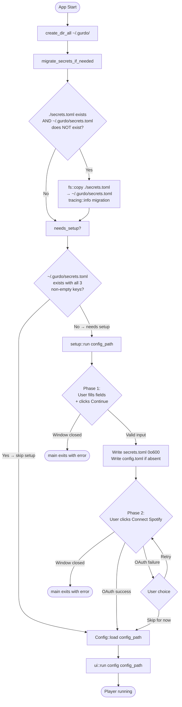

# i1-spec: EP-20 — First-run Setup Screen + User-Scoped Config/Secrets

**Epic:** EP-20
**Type:** Feature
**Priority:** P2
**Size:** M
**Iteration:** 017
**Date:** 2026-05-17

---

## Description

On first launch, when `~/.gurdo/secrets.toml` is absent or missing required keys, the app displays a dedicated setup screen instead of the main player. The user enters their Last.fm API key, Last.fm username, and Spotify client_id in a small eframe window; on confirmation, the app writes `~/.gurdo/secrets.toml` (chmod 600) and a default `~/.gurdo/config.toml`, then proceeds through a Spotify OAuth step before opening the player. This epic also relocates the canonical config and secrets paths from the working directory into `~/.gurdo/`, ensuring credentials are stored consistently regardless of how the binary is invoked. A one-time migration step silently copies any `./secrets.toml` found next to the CWD into `~/.gurdo/secrets.toml` so existing users are not disrupted.

**New dependency:** add `dirs = "5"` to `[dependencies]` in `Cargo.toml` for `dirs::home_dir()`.

---

## User Scenarios

**Scenario 1 — Happy path, first launch**
Given the user has never run Gurdo before (no `~/.gurdo/secrets.toml`),
When they launch the app,
Then they see the Setup window (440×400 px, title "Gurdo — Setup") with three labeled text fields: Last.fm API Key, Last.fm Username, and Spotify Client ID.

**Scenario 2 — Completing setup text fields**
Given the user has filled all three fields with non-empty values and clicked Continue,
When the app processes the input,
Then `~/.gurdo/secrets.toml` is written (chmod 600), a default `~/.gurdo/config.toml` is written if absent, and the window advances to Phase 2 showing a "Connect Spotify" button.

**Scenario 3 — Successful OAuth**
Given the user is on the OAuth phase of setup,
When they click "Connect Spotify" and the OAuth flow completes successfully,
Then the setup window closes and the main player window opens.

**Scenario 4 — Failed OAuth with retry or skip**
Given the user clicked "Connect Spotify" and the OAuth flow returned an error,
When the failure is displayed,
Then a "Retry" button and a "Skip for now" button are both visible. Clicking Retry re-attempts OAuth; clicking "Skip for now" closes the setup window and the main player opens (Spotify errors surface in-player until the user reconnects via Settings → Spotify).

**Scenario 5 — Returning user (secrets present and complete)**
Given `~/.gurdo/secrets.toml` exists and `api_key`, `username`, and `client_id` are all non-empty after trim,
When the user launches the app,
Then the setup screen is skipped entirely and the main player opens directly.

**Scenario 6 — Returning user with incomplete secrets**
Given `~/.gurdo/secrets.toml` exists but one or more of the three keys is absent or empty (after trim),
When the user launches the app,
Then the setup screen is shown, pre-populated with any values that are present.

**Scenario 7 — Migration of legacy secrets**
Given `./secrets.toml` exists in the current working directory and `~/.gurdo/secrets.toml` does not,
When the app starts,
Then `./secrets.toml` is copied to `~/.gurdo/secrets.toml`, a log-level info message is emitted, and the setup check proceeds against the new location.

---

## Acceptance Criteria

### Config and Secrets Path Changes

1. The default config path used by `parse_config_arg()` is `~/.gurdo/config.toml` (resolved via `dirs::home_dir()`). The existing `parse_config_arg_default` test in `main.rs` is updated to assert this new default path.

2. `Config::secrets_path(config_path)` always returns `~/.gurdo/secrets.toml` (resolved via `dirs::home_dir()`), regardless of the value of `config_path`, including when `-c` is passed with a custom path. A unit test asserts this invariant with at least two distinct `config_path` inputs (e.g., the default path and an arbitrary override path).

3. `~/.gurdo/` is created via `fs::create_dir_all` before any read or write of files under that directory. If creation fails, `main` exits with an `anyhow` error: `"Cannot create config directory ~/.gurdo/: <OS error>"`.

4. `dirs` crate version `5` is added to `[dependencies]` in `Cargo.toml`.

### Migration

5. On every launch, before the first-run check, `migrate_secrets_if_needed()` is called. It copies `./secrets.toml` (relative to CWD) to `~/.gurdo/secrets.toml` if and only if `./secrets.toml` exists AND `~/.gurdo/secrets.toml` does not exist. After copying, a `tracing::info!` message is emitted (key values are NOT logged). No other action is taken.

6. If both `./secrets.toml` and `~/.gurdo/secrets.toml` exist, migration is skipped without error or warning.

7. If neither file exists, migration is skipped without error.

### First-Run Detection

8. `needs_setup()` returns `true` if any of the following hold: `~/.gurdo/secrets.toml` does not exist; the file exists but cannot be parsed as TOML; `api_key` is absent or `.trim()` is empty; `username` is absent or `.trim()` is empty; `client_id` is absent or `.trim()` is empty.

9. `needs_setup()` returns `false` if and only if `~/.gurdo/secrets.toml` exists, parses successfully, and all three of `api_key`, `username`, and `client_id` are non-empty after `.trim()`.

### Setup Screen — General

10. `setup::run(config_path: &Path) -> anyhow::Result<()>` opens a standalone eframe window with the title "Gurdo — Setup", inner size 440×400 px, and no resizing. The function blocks until the setup window is closed and returns `Ok(())` on success.

11. Closing the setup window via the OS close button before completing Phase 1 causes `setup::run` to return `Err(...)` which is propagated to `main`, exiting with a non-zero code and a human-readable message: `"Setup cancelled — please re-run Gurdo to complete setup."`.

### Setup Screen — Phase 1 (Text Fields)

12. Phase 1 displays exactly three labeled `egui::TextEdit::singleline` fields in order: "Last.fm API Key", "Last.fm Username", "Spotify Client ID". Each field is full-width within the window (`desired_width(f32::INFINITY)`).

13. The "Continue" button is disabled while any of the three fields is empty or whitespace-only. It becomes enabled only when all three contain at least one non-whitespace character.

14. Clicking "Continue" with all fields non-empty writes `~/.gurdo/secrets.toml` containing the trimmed values of `api_key`, `username`, and `client_id`. The file is given permissions `0o600` immediately after writing (via `fs::set_permissions` + `PermissionsExt::from_mode` on Unix; no-op on Windows via `#[cfg(unix)]`). Key values are not written to any log.

15. Clicking "Continue" writes `~/.gurdo/config.toml` with default configuration values if and only if that file does not already exist. If the file already exists it is not overwritten.

16. If writing `~/.gurdo/secrets.toml` or `~/.gurdo/config.toml` fails, an inline error label is displayed in the Phase 1 UI with the OS error message. The user can fix the environmental issue and click Continue again without restarting the app.

### Setup Screen — Phase 2 (OAuth)

17. After a successful Phase 1 write, the UI transitions to Phase 2. Phase 1 fields are no longer visible. Phase 2 displays: a status label ("Connect your Spotify account to enable playback."), a "Connect Spotify" button, and a "Skip for now" button.

18. Clicking "Connect Spotify" calls `spotify::auth::run_oauth_flow`. While the flow is in progress the status label reads "Waiting for Spotify authorisation…" and both buttons are disabled.

19. If `run_oauth_flow` returns `Ok(())`, the setup window closes and `setup::run` returns `Ok(())`.

20. If `run_oauth_flow` returns `Err(e)`, the status label displays the error (e.g., "OAuth failed: \<e\>"). The button label changes to "Retry" and the "Skip for now" button is re-enabled. Clicking Retry re-invokes `run_oauth_flow`. Clicking "Skip for now" closes the setup window and `setup::run` returns `Ok(())`.

21. Closing the setup window via the OS close button during Phase 2 causes `setup::run` to return `Err(...)` propagated to `main`, which exits with: `"Setup cancelled during OAuth — Spotify not connected."`.

### Post-Setup Launch Sequence

22. After `setup::run` returns `Ok(())`, `main` calls `Config::load(config_path)` then `ui::run(config, config_path)` exactly as it would on a non-first-run launch. No special post-setup code path exists in `ui::run`.

### Security

23. `~/.gurdo/secrets.toml` has Unix permissions `0o600` immediately after being written. On Linux/macOS: `fs::metadata(...).permissions().mode() & 0o777 == 0o600`.

24. No function introduced by this epic logs, prints, or emits the string values of `api_key`, `username`, or `client_id`. Log messages may reference field names but not values.

---

## Out of Scope

- Multi-account support (setup writes exactly one set of credentials).
- Live validation of credentials against the Last.fm or Spotify APIs during setup.
- Password-manager or OS keychain integration.
- Full design polish, animations, or branding beyond a clean functional layout.
- Settings → Spotify reconnect UI changes (already handled by EP-6/EP-11 dispatcher path).
- Windows ACL-based secrets file locking.

---

## Edge Cases and Failure Modes

| Scenario | Expected Behaviour |
|---|---|
| `~/.gurdo/` is not writable | `create_dir_all` fails; `main` exits with error before setup screen shown. |
| `~/.gurdo/secrets.toml` not writable after dir exists | Phase 1 Continue shows inline error; user can fix and retry without restart. |
| OAuth flow times out | `run_oauth_flow` returns `Err`; treated as any other OAuth error (AC-20). |
| User closes setup window during Phase 1 | `setup::run` returns `Err`; `main` exits with message (AC-11). |
| User closes setup window during Phase 2 | `setup::run` returns `Err`; `main` exits with message (AC-21). |
| Both `./secrets.toml` and `~/.gurdo/secrets.toml` exist | Migration skipped (AC-6); existing `~/.gurdo/secrets.toml` used for first-run check. |
| `~/.gurdo/secrets.toml` exists but is not valid TOML | `needs_setup()` returns `true`; setup shown; Phase 1 Continue overwrites the file. |
| `home_dir()` returns `None` | `main` exits early with: "Cannot determine home directory; cannot locate ~/.gurdo/". |

---

## UI/UX Notes

### Window
- Title: "Gurdo — Setup"
- Inner size: 440 × 400 px, fixed (no resize, no maximize)
- Background: default egui theme

### Phase 1 — Credentials

```
┌─────────────────────────────────────────┐
│  Gurdo — Setup                          │
│                                         │
│  Welcome! Enter your credentials to     │
│  get started.                           │
│                                         │
│  Last.fm API Key                        │
│  [_______________________________________]
│                                         │
│  Last.fm Username                       │
│  [_______________________________________]
│                                         │
│  Spotify Client ID                      │
│  [_______________________________________]
│                                         │
│  [error label — hidden unless error]    │
│                                         │
│                          [ Continue ]   │
└─────────────────────────────────────────┘
```

### Phase 2 — OAuth

```
┌─────────────────────────────────────────┐
│  Gurdo — Setup                          │
│                                         │
│  Connect your Spotify account to        │
│  enable playback.                       │
│                                         │
│  [status label]                         │
│                                         │
│                                         │
│        [ Connect Spotify / Retry ]      │
│        [ Skip for now           ]       │
│                                         │
│                                         │
└─────────────────────────────────────────┘
```

- Status label: grey by default; red on error.
- While OAuth pending: label = "Waiting for Spotify authorisation…"; both buttons disabled.
- On error: label = "OAuth failed: \<message\>"; button = "Retry"; Skip re-enabled.

---

## Security Considerations

1. **File permissions:** `~/.gurdo/secrets.toml` is given `0o600` immediately after `fs::write`. A `#[cfg(unix)]` gate applies `PermissionsExt::from_mode`; the gate is a no-op on Windows.
2. **No credential logging:** Key values must never appear in `tracing::*` calls, `eprintln!`, or `dbg!`. Field names are acceptable in logs.
3. **Migration is copy-only:** `fs::copy` is used; destination permissions are set to `0o600` after copy regardless of source permissions.
4. **OAuth token storage:** Handled by existing `spotify::auth` module (EP-11 scope). Not changed here.

---

## Launch Decision Flow


